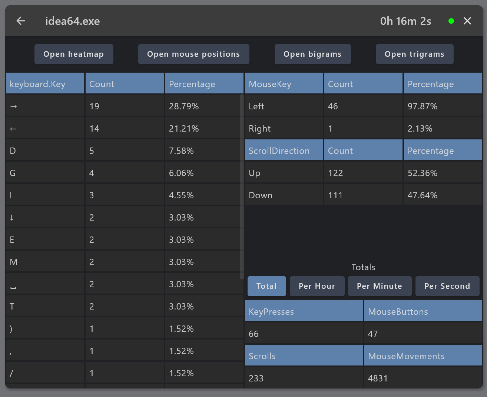

# KtLogger

Ktlogger is a simple desktop application that allows you to log your daily activities. Written in Kotlin and Compose
Multiplatform.

It provides a simple UI that allows you to monitor your daily activities and visualize them. All the data is stored
locally on your device in a local database.

**As of now only Windows is supported.**

**The application is just a hobby project that I use to track my activity and
develop keyboard layouts based on my own
corpus.**

You are free to use it, but it is not intended to be a finished product. You are welcome to make any changes you want or
to contribute to the project.

## TODO

- [ ] Abstract the keymap to make it easily configurable
- [ ] Add a way to import/export the data
- [ ] Abstract the logger layer to make it easy to add new loggers for different systems
