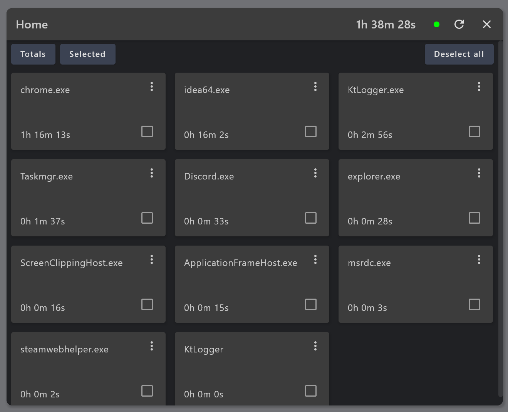
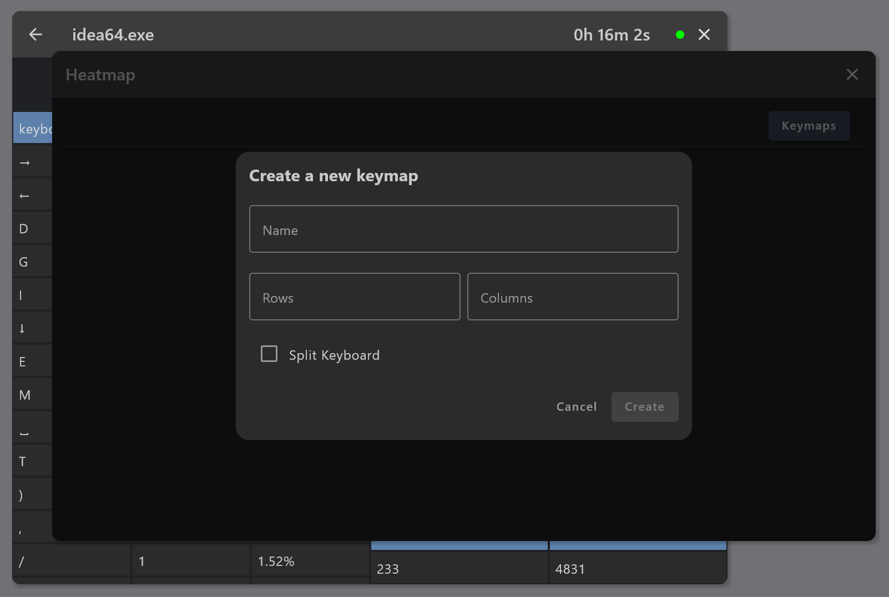

# KtLogger

**KtLogger** is a desktop application written in Kotlin using Compose Multiplatform that enables you to log
and analyze your daily computer usage. The application tracks key presses, mouse activity, and provides a detailed
breakdown of how you interact with different applications on your system. All data is stored locally on your machine.

⚠️ **Note**: For KtLogger to function properly, it needs to be run with **administrator privileges**.

---

## Features

- **Application Monitoring**: Track how much time you spend on each application
- **Key Press Analysis**: View a breakdown of the keys pressed per application, along with their frequency and
  percentages
- **Mouse Interaction Monitoring**: Analyze mouse button usage
- **Heatmaps & Analytics**: Generate heatmaps, mouse position maps, bigram, and trigram analysis based on your key
  presses
- **Local Data Storage**: Keeps all logged data secure on your local machine

---

## Screenshots






---

## Installation

### Requirements

- **Platform**: Currently supports **Windows** only.
- **Permissions**: You must run the application with **administrator privileges** to enable logging of keyboard and
  mouse activity.

### Installation Steps

1. **Download the Installer**: [Link to the release page]
2. **Run the Installer**: Follow the on-screen instructions.
3. **Locate the Application**: If the app does not appear in the start menu, you can find it here:
   ```
   C:\Program Files\KtLogger
   ```
4. **Run as Administrator**: Right-click the application and select **Run as administrator**.

---

## Usage

Once the application is running as an administrator, it will begin logging your key presses, mouse movements, and
interactions with different applications in the background.

- **Monitor Daily Activity**: The "Home" screen provides a quick overview of active applications and
  the time spent in each.
- **Analyze Usage**: Select any application from the dashboard to see a breakdown of your key and mouse activity.
- **Generate Visual Analytics**: Click on buttons like "Open Heatmap" or "Open Mouse Positions" for more in-depth visual
  data analysis.

---

## Contributing

Contributions are welcome! Feel free to:

- Fork the project.
- Make changes or improvements.
- Open a pull request with your contribution.

### TODO List / Future Enhancements

- **Data Import/Export**: Add support for exporting and importing data.
- **Mac and Linux support**: Implement loggers for Mac and Linux platforms using JNA
- **Improve UI**: Update and improve various UI components
- **Advanced filters**: Advanced filters and possibly graphs to analyze the data

---

### Final Notes

- After installation, if you cannot find the application in the start menu, check the following directory:
  `C:\Program Files\KtLogger`.
- Ensure that the application is running with administrator privileges for proper functionality.
